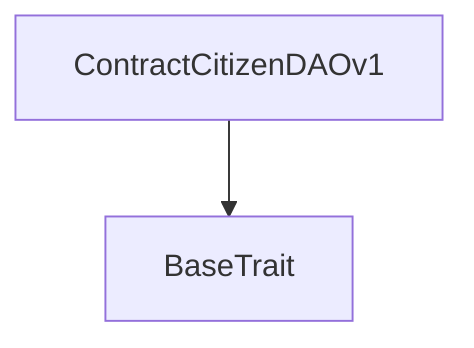
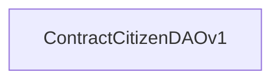

# Tact compilation report
Contract: ContractCitizenDAOv1
BoC Size: 692 bytes

## Structures (Structs and Messages)
Total structures: 101

### DataSize
TL-B: `_ cells:int257 bits:int257 refs:int257 = DataSize`
Signature: `DataSize{cells:int257,bits:int257,refs:int257}`

### SignedBundle
TL-B: `_ signature:fixed_bytes64 signedData:remainder<slice> = SignedBundle`
Signature: `SignedBundle{signature:fixed_bytes64,signedData:remainder<slice>}`

### StateInit
TL-B: `_ code:^cell data:^cell = StateInit`
Signature: `StateInit{code:^cell,data:^cell}`

### Context
TL-B: `_ bounceable:bool sender:address value:int257 raw:^slice = Context`
Signature: `Context{bounceable:bool,sender:address,value:int257,raw:^slice}`

### SendParameters
TL-B: `_ mode:int257 body:Maybe ^cell code:Maybe ^cell data:Maybe ^cell value:int257 to:address bounce:bool = SendParameters`
Signature: `SendParameters{mode:int257,body:Maybe ^cell,code:Maybe ^cell,data:Maybe ^cell,value:int257,to:address,bounce:bool}`

### MessageParameters
TL-B: `_ mode:int257 body:Maybe ^cell value:int257 to:address bounce:bool = MessageParameters`
Signature: `MessageParameters{mode:int257,body:Maybe ^cell,value:int257,to:address,bounce:bool}`

### DeployParameters
TL-B: `_ mode:int257 body:Maybe ^cell value:int257 bounce:bool init:StateInit{code:^cell,data:^cell} = DeployParameters`
Signature: `DeployParameters{mode:int257,body:Maybe ^cell,value:int257,bounce:bool,init:StateInit{code:^cell,data:^cell}}`

### StdAddress
TL-B: `_ workchain:int8 address:uint256 = StdAddress`
Signature: `StdAddress{workchain:int8,address:uint256}`

### VarAddress
TL-B: `_ workchain:int32 address:^slice = VarAddress`
Signature: `VarAddress{workchain:int32,address:^slice}`

### BasechainAddress
TL-B: `_ hash:Maybe int257 = BasechainAddress`
Signature: `BasechainAddress{hash:Maybe int257}`

### Deploy
TL-B: `deploy#946a98b6 queryId:uint64 = Deploy`
Signature: `Deploy{queryId:uint64}`

### DeployOk
TL-B: `deploy_ok#aff90f57 queryId:uint64 = DeployOk`
Signature: `DeployOk{queryId:uint64}`

### FactoryDeploy
TL-B: `factory_deploy#6d0ff13b queryId:uint64 cashback:address = FactoryDeploy`
Signature: `FactoryDeploy{queryId:uint64,cashback:address}`

### DAOvote
TL-B: `da_ovote#57f5d9f1 endTime:uint64 isJetton:bool isNFTSBT:bool metadata:^cell = DAOvote`
Signature: `DAOvote{endTime:uint64,isJetton:bool,isNFTSBT:bool,metadata:^cell}`

### WhiteList
TL-B: `white_list#dd633320 queryId:uint64 jettonWallet:address jettonMaster:address jettonFee:coins amount:coins admin:address = WhiteList`
Signature: `WhiteList{queryId:uint64,jettonWallet:address,jettonMaster:address,jettonFee:coins,amount:coins,admin:address}`

### DropCollection
TL-B: `drop_collection#a5e61af0 queryId:uint64 address:address = DropCollection`
Signature: `DropCollection{queryId:uint64,address:address}`

### ChangeAdminCitizen
TL-B: `change_admin_citizen#0000000b queryId:uint64 citizen:address address:address = ChangeAdminCitizen`
Signature: `ChangeAdminCitizen{queryId:uint64,citizen:address,address:address}`

### ChangeOwnerDAO
TL-B: `change_owner_dao#00000007 queryId:uint64 address:address = ChangeOwnerDAO`
Signature: `ChangeOwnerDAO{queryId:uint64,address:address}`

### GetFunds
TL-B: `get_funds#00000008 queryId:uint64 jettonWallet:address jettonAmount:coins = GetFunds`
Signature: `GetFunds{queryId:uint64,jettonWallet:address,jettonAmount:coins}`

### AddAdmin
TL-B: `add_admin#00000009 queryId:uint64 address:address = AddAdmin`
Signature: `AddAdmin{queryId:uint64,address:address}`

### RemoveAdmin
TL-B: `remove_admin#0000000a queryId:uint64 address:address = RemoveAdmin`
Signature: `RemoveAdmin{queryId:uint64,address:address}`

### ChangeTreasury
TL-B: `change_treasury#0000000c queryId:uint64 address:address = ChangeTreasury`
Signature: `ChangeTreasury{queryId:uint64,address:address}`

### JettonTransferNotification
TL-B: `jetton_transfer_notification#7362d09c queryId:uint64 amount:coins sender:address forwardPayload:remainder<slice> = JettonTransferNotification`
Signature: `JettonTransferNotification{queryId:uint64,amount:coins,sender:address,forwardPayload:remainder<slice>}`

### StartNewVoting
TL-B: `start_new_voting#b8ce5880 metadata:^cell settings:VoteSettings{endTime:uint64,min_amount:coins,quorum:uint32} = StartNewVoting`
Signature: `StartNewVoting{metadata:^cell,settings:VoteSettings{endTime:uint64,min_amount:coins,quorum:uint32}}`

### StartDAOVoting
TL-B: `start_dao_voting#2ad414aa queryId:uint64 metadata:^cell settings:VoteSettings{endTime:uint64,min_amount:coins,quorum:uint32} = StartDAOVoting`
Signature: `StartDAOVoting{queryId:uint64,metadata:^cell,settings:VoteSettings{endTime:uint64,min_amount:coins,quorum:uint32}}`

### InitVoting
TL-B: `init_voting#55d9ab43 queryId:uint64 totalSupply:coins = InitVoting`
Signature: `InitVoting{queryId:uint64,totalSupply:coins}`

### ActivateVote
TL-B: `activate_vote#29260a40 contractAddress:address admin:address = ActivateVote`
Signature: `ActivateVote{contractAddress:address,admin:address}`

### CallVote
TL-B: `call_vote#19ef3d5b queryId:uint64 = CallVote`
Signature: `CallVote{queryId:uint64}`

### GiveVote
TL-B: `give_vote#b5487dc9 queryId:uint64 = GiveVote`
Signature: `GiveVote{queryId:uint64}`

### TakeVote
TL-B: `take_vote#ebf2f4ce queryId:uint64 = TakeVote`
Signature: `TakeVote{queryId:uint64}`

### TakeDAOVote
TL-B: `take_dao_vote#e94e61b2 adminAddress:address optionAddress:address = TakeDAOVote`
Signature: `TakeDAOVote{adminAddress:address,optionAddress:address}`

### PassPassport
TL-B: `pass_passport#0000deed queryId:uint64 address:address = PassPassport`
Signature: `PassPassport{queryId:uint64,address:address}`

### SetToken
TL-B: `set_token#c0c0dd4d dao_fee:coins = SetToken`
Signature: `SetToken{dao_fee:coins}`

### AddOption
TL-B: `add_option#c8b1f5ab queryId:uint64 title:^string description:^string = AddOption`
Signature: `AddOption{queryId:uint64,title:^string,description:^string}`

### VaultInitialization
TL-B: `vault_initialization#db89bc8a queryId:uint64 admin:address = VaultInitialization`
Signature: `VaultInitialization{queryId:uint64,admin:address}`

### VirtualInitialization
TL-B: `virtual_initialization#0d7bbd5c queryId:uint64 optionAddress:address = VirtualInitialization`
Signature: `VirtualInitialization{queryId:uint64,optionAddress:address}`

### SubmitVoting
TL-B: `submit_voting#efc982b2 queryId:uint64 adminAddress:address optionAddress:address = SubmitVoting`
Signature: `SubmitVoting{queryId:uint64,adminAddress:address,optionAddress:address}`

### CancelVoting
TL-B: `cancel_voting#1df76c5f queryId:uint64 adminAddress:address optionAddress:address = CancelVoting`
Signature: `CancelVoting{queryId:uint64,adminAddress:address,optionAddress:address}`

### ProvideAction
TL-B: `provide_action#16f5c9cb queryId:uint64 address:address payload:^cell = ProvideAction`
Signature: `ProvideAction{queryId:uint64,address:address,payload:^cell}`

### ProvideActionDAO
TL-B: `provide_action_dao#6e224c67 queryId:uint64 admin:address payload:^cell = ProvideActionDAO`
Signature: `ProvideActionDAO{queryId:uint64,admin:address,payload:^cell}`

### ProvideVoting
TL-B: `provide_voting#383977b6 optionAddress:address = ProvideVoting`
Signature: `ProvideVoting{optionAddress:address}`

### PassportControl
TL-B: `passport_control#deadbeef queryId:uint64 citizen:address status:uint4 = PassportControl`
Signature: `PassportControl{queryId:uint64,citizen:address,status:uint4}`

### JettonData
TL-B: `_ totalSupply:int257 mintable:bool owner:address content:^cell jettonWalletCode:^cell = JettonData`
Signature: `JettonData{totalSupply:int257,mintable:bool,owner:address,content:^cell,jettonWalletCode:^cell}`

### JettonWalletData
TL-B: `_ balance:int257 owner:address minter:address code:^cell = JettonWalletData`
Signature: `JettonWalletData{balance:int257,owner:address,minter:address,code:^cell}`

### MaybeAddress
TL-B: `_ address:address = MaybeAddress`
Signature: `MaybeAddress{address:address}`

### JettonTransfer
TL-B: `jetton_transfer#0f8a7ea5 queryId:uint64 amount:coins destination:address responseDestination:address customPayload:Maybe ^cell forwardTonAmount:coins forwardPayload:remainder<slice> = JettonTransfer`
Signature: `JettonTransfer{queryId:uint64,amount:coins,destination:address,responseDestination:address,customPayload:Maybe ^cell,forwardTonAmount:coins,forwardPayload:remainder<slice>}`

### JettonBurn
TL-B: `jetton_burn#595f07bc queryId:uint64 amount:coins responseDestination:address customPayload:Maybe ^cell = JettonBurn`
Signature: `JettonBurn{queryId:uint64,amount:coins,responseDestination:address,customPayload:Maybe ^cell}`

### JettonNotification
TL-B: `jetton_notification#7362d09c queryId:uint64 amount:coins sender:address forwardPayload:remainder<slice> = JettonNotification`
Signature: `JettonNotification{queryId:uint64,amount:coins,sender:address,forwardPayload:remainder<slice>}`

### JettonExcesses
TL-B: `jetton_excesses#d53276db queryId:uint64 = JettonExcesses`
Signature: `JettonExcesses{queryId:uint64}`

### JettonTransferInternal
TL-B: `jetton_transfer_internal#178d4519 queryId:uint64 amount:coins sender:address responseDestination:address forwardTonAmount:coins forwardPayload:remainder<slice> = JettonTransferInternal`
Signature: `JettonTransferInternal{queryId:uint64,amount:coins,sender:address,responseDestination:address,forwardTonAmount:coins,forwardPayload:remainder<slice>}`

### JettonBurnNotification
TL-B: `jetton_burn_notification#7bdd97de queryId:uint64 amount:coins sender:address responseDestination:address = JettonBurnNotification`
Signature: `JettonBurnNotification{queryId:uint64,amount:coins,sender:address,responseDestination:address}`

### ProvideWalletAddress
TL-B: `provide_wallet_address#2c76b973 queryId:uint64 ownerAddress:address includeAddress:bool = ProvideWalletAddress`
Signature: `ProvideWalletAddress{queryId:uint64,ownerAddress:address,includeAddress:bool}`

### TakeWalletAddress
TL-B: `take_wallet_address#d1735400 queryId:uint64 walletAddress:address ownerAddress:Maybe ^cell = TakeWalletAddress`
Signature: `TakeWalletAddress{queryId:uint64,walletAddress:address,ownerAddress:Maybe ^cell}`

### TopUp
TL-B: `top_up#d372158c queryId:uint64 = TopUp`
Signature: `TopUp{queryId:uint64}`

### SetStatus
TL-B: `set_status#eed236d3 queryId:uint64 status:uint4 = SetStatus`
Signature: `SetStatus{queryId:uint64,status:uint4}`

### Mint
TL-B: `mint#642b7d07 queryId:uint64 toAddress:address masterMsg:JettonTransferInternal{queryId:uint64,amount:coins,sender:address,responseDestination:address,forwardTonAmount:coins,forwardPayload:remainder<slice>} = Mint`
Signature: `Mint{queryId:uint64,toAddress:address,masterMsg:JettonTransferInternal{queryId:uint64,amount:coins,sender:address,responseDestination:address,forwardTonAmount:coins,forwardPayload:remainder<slice>}}`

### ChangeAdmin
TL-B: `change_admin#6501f354 queryId:uint64 newAdminAddress:address = ChangeAdmin`
Signature: `ChangeAdmin{queryId:uint64,newAdminAddress:address}`

### ClaimAdmin
TL-B: `claim_admin#fb88e119 queryId:uint64 = ClaimAdmin`
Signature: `ClaimAdmin{queryId:uint64}`

### CallTo
TL-B: `call_to#235caf52 queryId:uint64 toAddress:address tonAmount:coins masterMsg:^cell = CallTo`
Signature: `CallTo{queryId:uint64,toAddress:address,tonAmount:coins,masterMsg:^cell}`

### Upgrade
TL-B: `upgrade#2508d66a queryId:uint64 newData:^cell newCode:^cell = Upgrade`
Signature: `Upgrade{queryId:uint64,newData:^cell,newCode:^cell}`

### ChangeMetadataUri
TL-B: `change_metadata_uri#cb862902 queryId:uint64 metadata:remainder<slice> = ChangeMetadataUri`
Signature: `ChangeMetadataUri{queryId:uint64,metadata:remainder<slice>}`

### ProvideWalletBalance
TL-B: `provide_wallet_balance#7ac8d559 receiver:address includeVerifyInfo:bool = ProvideWalletBalance`
Signature: `ProvideWalletBalance{receiver:address,includeVerifyInfo:bool}`

### VerifyInfo
TL-B: `_ owner:address minter:address code:^cell = VerifyInfo`
Signature: `VerifyInfo{owner:address,minter:address,code:^cell}`

### TakeWalletBalance
TL-B: `take_wallet_balance#ca77fdc2 balance:coins verifyInfo:Maybe VerifyInfo{owner:address,minter:address,code:^cell} = TakeWalletBalance`
Signature: `TakeWalletBalance{balance:coins,verifyInfo:Maybe VerifyInfo{owner:address,minter:address,code:^cell}}`

### TokenInfo
TL-B: `_ jetton_master:address jetton_fee:coins amount:coins admin:address = TokenInfo`
Signature: `TokenInfo{jetton_master:address,jetton_fee:coins,amount:coins,admin:address}`

### DaoToken
TL-B: `_ jetton_wallet:address dao_fee:coins = DaoToken`
Signature: `DaoToken{jetton_wallet:address,dao_fee:coins}`

### OptionInfo
TL-B: `_ title:^string description:^string = OptionInfo`
Signature: `OptionInfo{title:^string,description:^string}`

### OptionInfoRoot
TL-B: `_ address:address title:^string description:^string = OptionInfoRoot`
Signature: `OptionInfoRoot{address:address,title:^string,description:^string}`

### VoteSettings
TL-B: `_ endTime:uint64 min_amount:coins quorum:uint32 = VoteSettings`
Signature: `VoteSettings{endTime:uint64,min_amount:coins,quorum:uint32}`

### StartNewVotingStruct
TL-B: `_ metadata:^cell settings:VoteSettings{endTime:uint64,min_amount:coins,quorum:uint32} = StartNewVotingStruct`
Signature: `StartNewVotingStruct{metadata:^cell,settings:VoteSettings{endTime:uint64,min_amount:coins,quorum:uint32}}`

### StartNewVotingTestStruct
TL-B: `_ endTime:uint64 min_amount:coins fee:coins = StartNewVotingTestStruct`
Signature: `StartNewVotingTestStruct{endTime:uint64,min_amount:coins,fee:coins}`

### TakeDAOVoteStruct
TL-B: `_ adminAddress:address optionAddress:address = TakeDAOVoteStruct`
Signature: `TakeDAOVoteStruct{adminAddress:address,optionAddress:address}`

### SliceBitsAndRefs
TL-B: `_ bits:int257 refs:int257 = SliceBitsAndRefs`
Signature: `SliceBitsAndRefs{bits:int257,refs:int257}`

### ContractDAOv1$Data
TL-B: `_ owner:address admin:address wallet:address master:address status:uint4 metadata:^cell settings:VoteSettings{endTime:uint64,min_amount:coins,quorum:uint32} options:dict<address, ^OptionInfoRoot{address:address,title:^string,description:^string}> = ContractDAOv1`
Signature: `ContractDAOv1{owner:address,admin:address,wallet:address,master:address,status:uint4,metadata:^cell,settings:VoteSettings{endTime:uint64,min_amount:coins,quorum:uint32},options:dict<address, ^OptionInfoRoot{address:address,title:^string,description:^string}>}`

### ContractDAOv2$Data
TL-B: `_ owner:address admin:address master:address status:uint4 metadata:^cell settings:VoteSettings{endTime:uint64,min_amount:coins,quorum:uint32} options:dict<address, ^OptionInfoRoot{address:address,title:^string,description:^string}> = ContractDAOv2`
Signature: `ContractDAOv2{owner:address,admin:address,master:address,status:uint4,metadata:^cell,settings:VoteSettings{endTime:uint64,min_amount:coins,quorum:uint32},options:dict<address, ^OptionInfoRoot{address:address,title:^string,description:^string}>}`

### NFTCollection$Data
TL-B: `_ owner:address admin:address nextItemIndex:uint64 content:^cell defaultContent:^cell royaltyParams:RoyaltyParams{nominator:uint16,dominator:uint16,owner:address} commonCode:^cell commonData:^builder = NFTCollection`
Signature: `NFTCollection{owner:address,admin:address,nextItemIndex:uint64,content:^cell,defaultContent:^cell,royaltyParams:RoyaltyParams{nominator:uint16,dominator:uint16,owner:address},commonCode:^cell,commonData:^builder}`

### DictGet
TL-B: `_ itemIndex:Maybe uint64 item:Maybe ^slice flag:int257 = DictGet`
Signature: `DictGet{itemIndex:Maybe uint64,item:Maybe ^slice,flag:int257}`

### DictItem
TL-B: `_ amount:coins initNFTBody:^cell = DictItem`
Signature: `DictItem{amount:coins,initNFTBody:^cell}`

### Transfer
TL-B: `transfer#5fcc3d14 queryId:uint64 newOwner:address responseDestination:address customPayload:Maybe ^cell forwardAmount:coins forwardPayload:remainder<slice> = Transfer`
Signature: `Transfer{queryId:uint64,newOwner:address,responseDestination:address,customPayload:Maybe ^cell,forwardAmount:coins,forwardPayload:remainder<slice>}`

### GetStaticData
TL-B: `get_static_data#2fcb26a2 queryId:uint64 = GetStaticData`
Signature: `GetStaticData{queryId:uint64}`

### NFTData
TL-B: `_ init:int257 itemIndex:uint64 collectionAddress:address owner:address content:Maybe ^cell = NFTData`
Signature: `NFTData{init:int257,itemIndex:uint64,collectionAddress:address,owner:address,content:Maybe ^cell}`

### InitNFTData
TL-B: `_ collectionAddress:address itemIndex:uint64 = InitNFTData`
Signature: `InitNFTData{collectionAddress:address,itemIndex:uint64}`

### InitNFTBody
TL-B: `_ owner:address content:^cell = InitNFTBody`
Signature: `InitNFTBody{owner:address,content:^cell}`

### CollectionData
TL-B: `_ nextItemIndex:uint64 collectionContent:^cell owner:address = CollectionData`
Signature: `CollectionData{nextItemIndex:uint64,collectionContent:^cell,owner:address}`

### RoyaltyParams
TL-B: `_ nominator:uint16 dominator:uint16 owner:address = RoyaltyParams`
Signature: `RoyaltyParams{nominator:uint16,dominator:uint16,owner:address}`

### GetRoyaltyParams
TL-B: `get_royalty_params#693d3950 queryId:uint64 = GetRoyaltyParams`
Signature: `GetRoyaltyParams{queryId:uint64}`

### DeployNFT
TL-B: `deploy_nft#00000001 queryId:uint64 itemIndex:uint64 amount:coins initNFTBody:^cell = DeployNFT`
Signature: `DeployNFT{queryId:uint64,itemIndex:uint64,amount:coins,initNFTBody:^cell}`

### EditContent
TL-B: `edit_content#1a0b9d51 queryId:uint64 content:^cell = EditContent`
Signature: `EditContent{queryId:uint64,content:^cell}`

### BatchDeploy
TL-B: `batch_deploy#00000002 queryId:uint64 deployList:^cell = BatchDeploy`
Signature: `BatchDeploy{queryId:uint64,deployList:^cell}`

### ChangeOwner
TL-B: `change_owner#00000003 queryId:uint64 newOwner:address = ChangeOwner`
Signature: `ChangeOwner{queryId:uint64,newOwner:address}`

### ReportRoyaltyParams
TL-B: `report_royalty_params#a8cb00ad queryId:uint64 params:RoyaltyParams{nominator:uint16,dominator:uint16,owner:address} = ReportRoyaltyParams`
Signature: `ReportRoyaltyParams{queryId:uint64,params:RoyaltyParams{nominator:uint16,dominator:uint16,owner:address}}`

### ContractCitizenDAOv1$Data
TL-B: `_ owner:address admin:address status:uint4 = ContractCitizenDAOv1`
Signature: `ContractCitizenDAOv1{owner:address,admin:address,status:uint4}`

### JettonMinterState
TL-B: `_ totalSupply:coins mintable:bool adminAddress:address jettonContent:^cell jettonWalletCode:^cell = JettonMinterState`
Signature: `JettonMinterState{totalSupply:coins,mintable:bool,adminAddress:address,jettonContent:^cell,jettonWalletCode:^cell}`

### GovernanceJettonMinter$Data
TL-B: `_ totalSupply:coins adminAddress:address nextAdminAddress:address jettonContent:^cell = GovernanceJettonMinter`
Signature: `GovernanceJettonMinter{totalSupply:coins,adminAddress:address,nextAdminAddress:address,jettonContent:^cell}`

### JettonWalletGovernance$Data
TL-B: `_ status:uint4 balance:coins owner:address master:address = JettonWalletGovernance`
Signature: `JettonWalletGovernance{status:uint4,balance:coins,owner:address,master:address}`

### ContractVaultDAOv1$Data
TL-B: `_ owner:address status:uint4 data:OptionInfo{title:^string,description:^string} = ContractVaultDAOv1`
Signature: `ContractVaultDAOv1{owner:address,status:uint4,data:OptionInfo{title:^string,description:^string}}`

### ContractJettonDAOv1$Data
TL-B: `_ owner:address admin:address option:address wallet:address amount:coins = ContractJettonDAOv1`
Signature: `ContractJettonDAOv1{owner:address,admin:address,option:address,wallet:address,amount:coins}`

### ContractVirtualDAOv2$Data
TL-B: `_ owner:address admin:address option:address status:uint4 = ContractVirtualDAOv2`
Signature: `ContractVirtualDAOv2{owner:address,admin:address,option:address,status:uint4}`

### NFTItemInit
TL-B: `_ owner:address content:^cell = NFTItemInit`
Signature: `NFTItemInit{owner:address,content:^cell}`

### NFTItem$Data
TL-B: `_ owner:address content:Maybe ^cell editor:address collectionAddress:address itemIndex:uint64 = NFTItem`
Signature: `NFTItem{owner:address,content:Maybe ^cell,editor:address,collectionAddress:address,itemIndex:uint64}`

### MasterDAO$Data
TL-B: `_ owner:address treasury:address fees:coins admins:dict<address, bool> collection:address token:Maybe DaoToken{jetton_wallet:address,dao_fee:coins} = MasterDAO`
Signature: `MasterDAO{owner:address,treasury:address,fees:coins,admins:dict<address, bool>,collection:address,token:Maybe DaoToken{jetton_wallet:address,dao_fee:coins}}`

## Get methods
Total get methods: 3

## get_owner
No arguments

## get_admin
No arguments

## get_status
No arguments

## Exit codes
* 2: Stack underflow
* 3: Stack overflow
* 4: Integer overflow
* 5: Integer out of expected range
* 6: Invalid opcode
* 7: Type check error
* 8: Cell overflow
* 9: Cell underflow
* 10: Dictionary error
* 11: 'Unknown' error
* 12: Fatal error
* 13: Out of gas error
* 14: Virtualization error
* 32: Action list is invalid
* 33: Action list is too long
* 34: Action is invalid or not supported
* 35: Invalid source address in outbound message
* 36: Invalid destination address in outbound message
* 37: Not enough Toncoin
* 38: Not enough extra currencies
* 39: Outbound message does not fit into a cell after rewriting
* 40: Cannot process a message
* 41: Library reference is null
* 42: Library change action error
* 43: Exceeded maximum number of cells in the library or the maximum depth of the Merkle tree
* 50: Account state size exceeded limits
* 128: Null reference exception
* 129: Invalid serialization prefix
* 130: Invalid incoming message
* 131: Constraints error
* 132: Access denied
* 133: Contract stopped
* 134: Invalid argument
* 135: Code of a contract was not found
* 136: Invalid standard address
* 138: Not a basechain address
* 2366: Incorrect balance after send
* 9215: Incorrect sender
* 10363: Unauthorized burn
* 12119: insufficient amount
* 14101: already exists
* 14534: Not owner
* 16693: vote time is not over
* 21196: Contract is locked
* 30277: Incoming transfers are locked
* 32113: Insufficient amount of TON attached
* 32290: vote time is over
* 35251: time expired
* 42884: gas error
* 45676: wrong operation
* 46257: Wrong workchain
* 46467: not enough
* 52585: bad request
* 54285: unknown wallet
* 61686: access denied
* 63951: Not next admin
* 63977: unknown contract

## Trait inheritance diagram

## Contract dependency diagram

